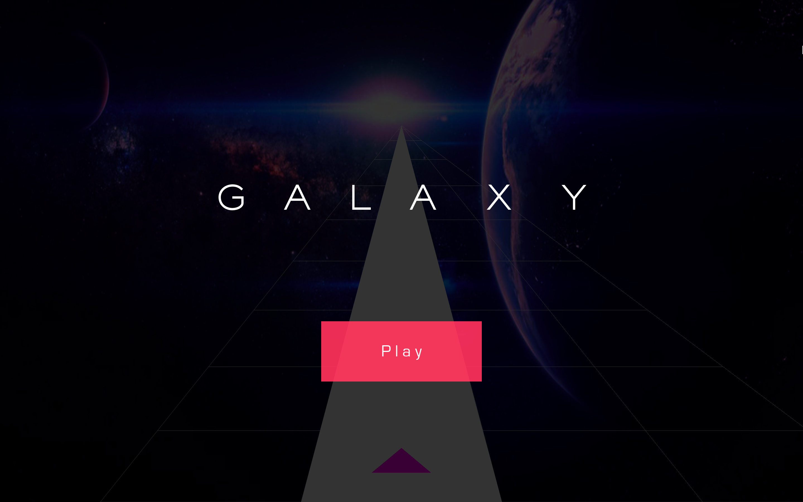
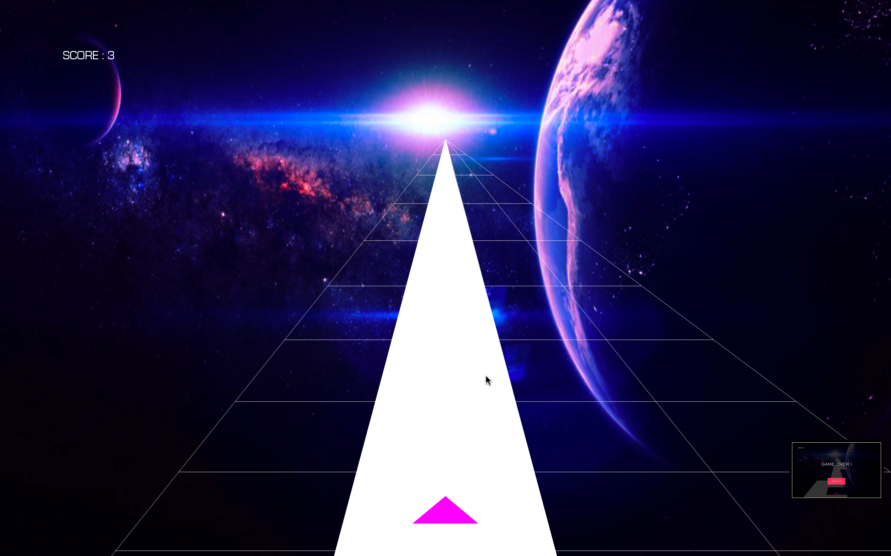
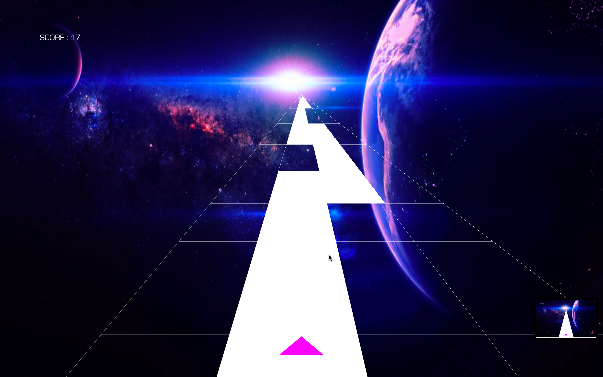
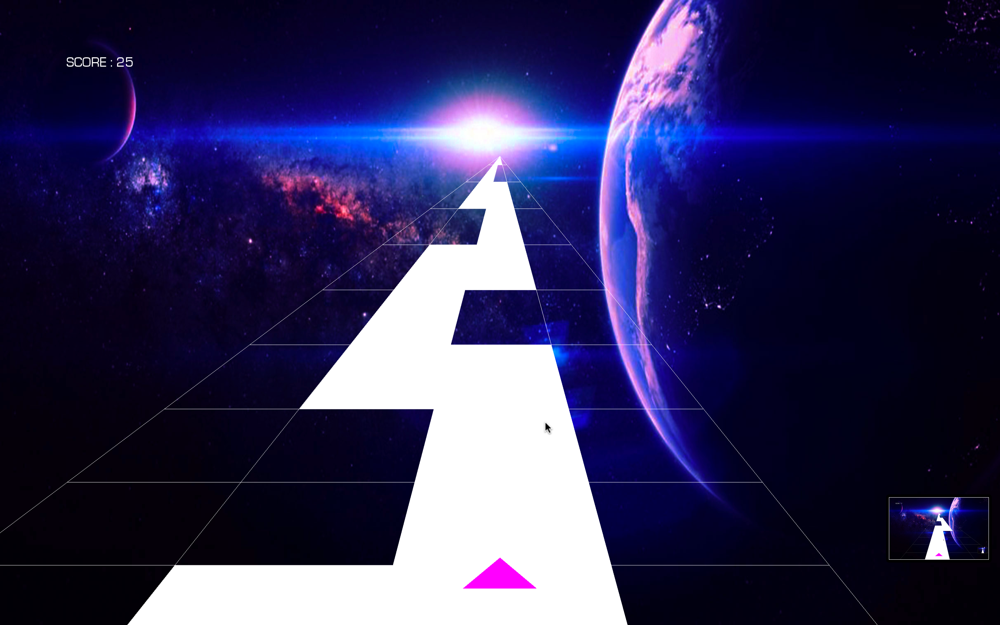
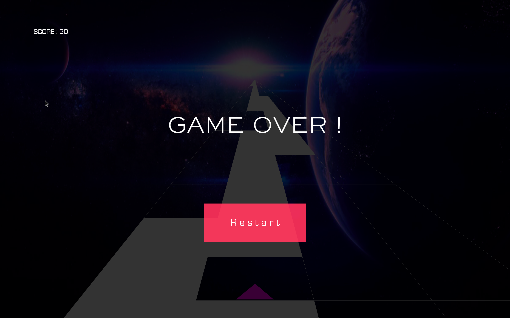

# GALAXY GAME

#### Steps to run

- pip install -r requirements.txt
- python3 main.py

### Rules

- Try to keep the Triangle Spaceship on the white track
- Moving out of the track full will lead to Game Over!
- Partially lying inside white track is included as "inside"
- Full off track will lead to Game Over!

### Controls

- Use arrow keys for movement (LEFT <- and -> RIGHT)
- Touch Screen support is also available .
- To move just Tap on the respective side of movement
